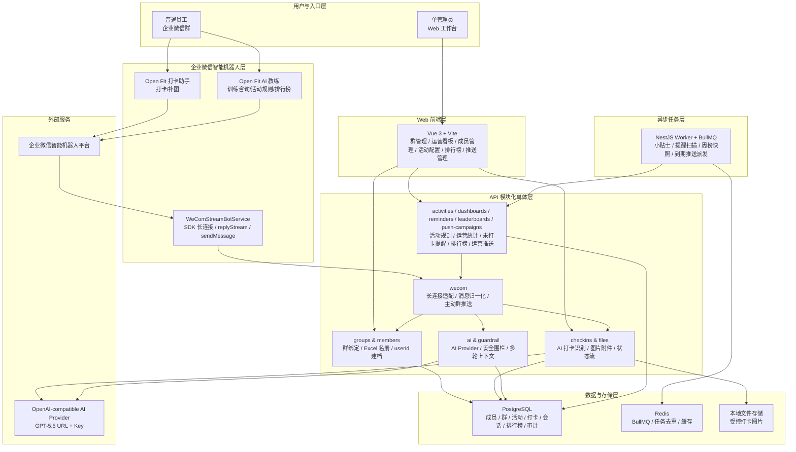
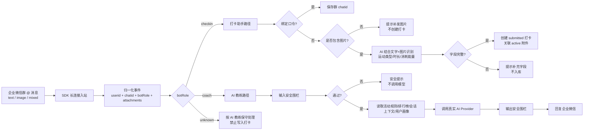
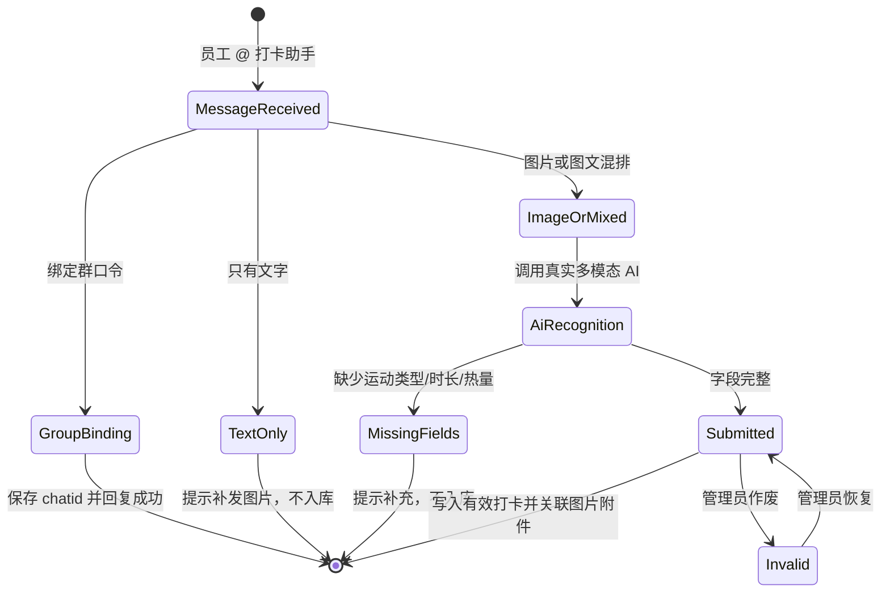
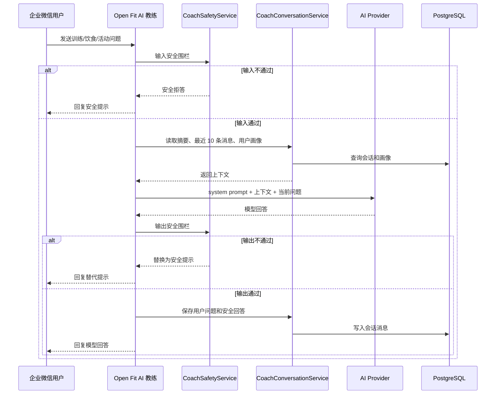
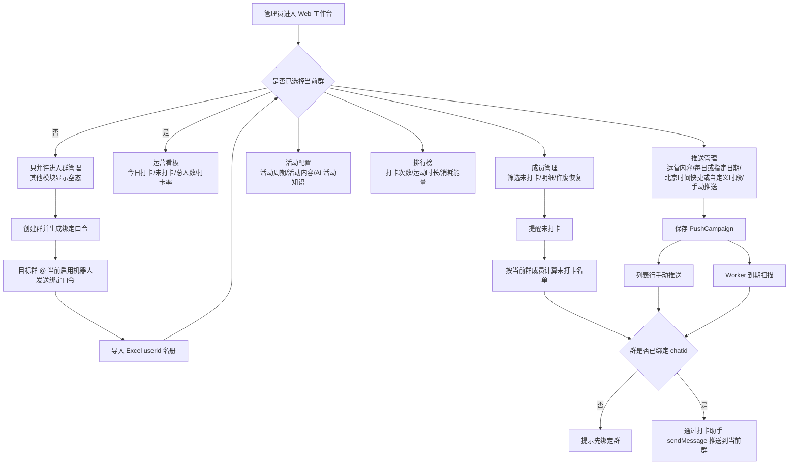

# 基础架构

## 架构图与逻辑图维护约定

当前可用的图表技能中，`architecture` 适合生成演示级 HTML 分层架构图，`bpmn` 适合业务流程和消息流，`uml` 适合时序图、组件图和部署图，`graphviz` 适合依赖关系和模块关系，`mindmap` 适合需求拆解。知识库优先使用 Mermaid/PlantUML/DOT 这类文本图，保证可 diff、可 review、可长期维护；HTML 架构图优先用于演示页或方案汇报，不作为基础架构文档的主表达。

本项目长期维护两类图：

- `docs/知识库/基础架构.md`：保存系统级架构图和跨模块逻辑图。
- `docs/知识库/机器人架构与流程图.md`：保存企业微信机器人专项图谱，包括双机器人职责、群绑定、打卡、AI 教练记忆和群提醒。

## 系统分层架构图

## 企业微信机器人核心逻辑图

核心约束：

- 打卡助手只负责打卡闭环；AI 教练不创建打卡记录。任一智能机器人收到有效群绑定口令时，都可以捕获该群 `chatid` 并记录绑定机器人角色。
- 企业微信身份以 `from.userid` 为主键来源；中文名和部门来自 Excel 名册导入。
- 群内主动推送以 `WeComGroup.chatId` 为目标，通过该群绑定时记录的智能机器人角色发送；只启用 AI 教练时，后台推送走 AI 教练长连接。
- AI 教练输入未通过安全围栏时不调用模型；输出未通过安全围栏时不发送模型原文。

## 打卡闭环逻辑图

## AI 教练上下文与安全逻辑图

## 后台按群运营逻辑图

## AI 教练提示词架构

- AI 教练的核心系统提示词集中维护在 `apps/api/src/ai/coach-guardrail.ts` 的 `coachSystemPrompt`，由 `AiProviderService.generateCoachAdviceWithMessages()` 作为首条 system message 注入模型。
- `CoachSafetyService` 只负责输入/输出安全围栏和高风险拦截，不负责生成普通低风险回答的话术；真人感、幽默感、免责声明变体等表达策略应通过系统提示词控制。
- AI 教练普通回复长度通过系统提示词约束，要求模型主动控制在 500 字以内；服务端不做内容截断，避免破坏模型回答结构和安全提示完整性。
- 企业微信 `Open Fit AI 教练` 和 Web Coach API 共用同一套 AI Provider 与安全围栏，因此提示词调整会同时影响两个入口。

## AI 教练记忆数据模型

- `CoachConversation` 和 `CoachConversationMessage` 保存 AI 教练短期会话上下文，按 `orgId + chatid + wecomUserid` 或单聊 `orgId + wecomUserid` 隔离。
- 短期会话默认 3 天未互动后不再参与 AI 上下文；服务启动时会清理超过 30 天未更新的会话和消息记录。
- `CoachProfileMemory` 保存长期结构化用户画像，按成员唯一；画像字段以 JSON 保存目标、运动偏好、训练限制和其他稳定信息。
- 用户画像不自动过期，不因“清空上下文”而删除；它不是聊天原文归档，只作为 AI 教练个性化建议的结构化输入。
## Docker 数据持久化
- Docker Compose 中 PostgreSQL 使用 named volume `openfit-postgres-data` 持久化数据。
- `pnpm docker:down` 只删除容器和网络，不删除 named volume；再次 `pnpm docker:up` 会恢复历史数据库数据。
- `pnpm docker:up` 只负责启动 Compose 服务，不强制重新构建镜像；需要构建镜像时使用 `pnpm docker:build`，需要构建并启动时使用 `pnpm docker:up:build`，需要停止后重新启动时使用 `pnpm docker:restart`。
- 需要清空历史数据和内置演示数据时，使用 `pnpm docker:reset`，该命令等价于 `docker compose -f infra/docker/docker-compose.yml down -v`。
- 清空 volume 后只需要重新启动服务：`pnpm docker:up`。API 容器启动时会先执行数据库 bootstrap，自动同步 Prisma schema 创建表结构，并写入幂等基础组织、活动和企业微信配置数据；bootstrap 不写入演示成员，成员列表来自企业微信消息自动建档或群管理 Excel userid 名册导入。
- 本地上传目录 `storage/uploads` 是宿主机目录挂载，不随 `docker:reset` 删除。
- 活动配置当前不再使用独立 `ActivityRule` 表；活动名称保存在 `Activity.name`，活动内容和规则说明保存在 `Activity.ruleJson.content`。

## 初始模块

- 企业微信接入层：智能机器人 SDK 长连接、群内 @、按群主动推送。
- AI 服务层：问答、图片识别、文本解析、安全边界判断。
- 打卡业务层：运动记录、识别确认、修正、撤回、作废。
- 统计分析层：排行榜、仪表盘、活动周期统计、提醒名单。
- Web 展示层：单管理员后台、群管理、运营看板、成员管理、活动配置、排行榜管理、推送管理。
- 调度任务层：每日小贴士、未打卡提醒、每周排行榜、运营推送到期派发。

## MVP 推荐运行时组件

- Web 工作台：Vue 3 + Vite + TypeScript，只覆盖单管理员运营后台；普通员工不使用 Web。
- API 服务：Node.js + NestJS 模块化单体，按身份、成员、活动、打卡、排行榜、提醒、企业微信、AI、审计拆分模块。
- Worker：Node.js + NestJS worker + BullMQ，处理每日小贴士、未打卡提醒、周榜快照和企业微信消息发送。
- 数据库：PostgreSQL，保存成员、活动、打卡、识别结果、排行榜、提醒、企业微信配置和审计。
- 队列与缓存：Redis，支撑 BullMQ、任务去重和企业微信 token 缓存。
- 文件存储：MVP 采用本地磁盘存储，通过配置上传根目录、访问路由、权限检查和备份策略管理文件；后续多实例部署时再评估对象存储。
- 部署：MVP 优先 Docker Compose 或内网 VM，后续再评估 Kubernetes 或服务拆分。
- 本地开发宿主机端口统一避开常用默认端口：API `13100`、Web `15173`、PostgreSQL `15432`、Redis `16380`；Docker Compose 内部服务之间仍使用容器标准端口。

## 第一阶段代码结构

- `apps/web`：Vue 3 + Vite Web 工作台，当前提供群管理、运营看板、成员管理、活动配置、排行榜管理和推送管理。
- `apps/api`：NestJS API 服务，提供健康检查、单管理员身份占位、群管理、活动、打卡、dashboard、提醒、推送管理、企业微信长连接和文件访问。
- `apps/api` 的第二阶段增量已经包含排行榜实时计算、排行榜快照、提醒扫描/重试和管理员打卡作废审计。
- `apps/worker`：NestJS worker，第一阶段定义 BullMQ 队列并提供企业微信消息 job 边界；当前还负责周期调用 API 内部接口派发到期运营推送。
- `packages/shared`：前后端共享状态枚举、错误码和 API 契约。
- `infra/docker`：本地 Docker Compose 构建并启动 PostgreSQL、Redis、API、worker 和 Web；Node 镜像在 build 阶段安装依赖并编译，依赖安装阶段使用 BuildKit cache mount 缓存 pnpm store，API 和 Worker 的 `pnpm deploy --prod` 必须使用 `pnpm --offline`，避免 deploy 阶段重新访问 npm 元数据导致镜像构建卡死或超时；运行阶段只执行编译产物，Web 由 nginx 提供静态文件。
- `storage/uploads`：MVP 本地上传根目录占位，不允许作为静态目录直接公开。

## 企业微信边界

- 员工侧企业微信交互采用两个智能机器人：`Open Fit 打卡助手` 负责打卡闭环，`Open Fit AI 教练` 负责训练咨询、活动规则和排行榜查询。
- 企业微信机器人架构图、群绑定流程、打卡助手流程、AI 教练记忆流程和后台提醒流程集中维护在 `docs/知识库/机器人架构与流程图.md`；后续机器人边界变化时必须同步更新该图谱文档。
- 企业微信智能机器人入站采用官方 Node SDK 长连接方式：API 服务启动后通过 `Bot ID + Secret` 连接 `wss://openws.work.weixin.qq.com`，监听文本、图片和图文混排消息。
- 企业微信入站消息通过长连接配置注入的 `botRole` 或消息中的 `botId` 区分机器人职责；无法识别来源时按 AI 教练保守处理，不写入打卡。
- 企业微信入站消息需要归一化为文本、图片和图文混排三类业务输入；图片素材下载或占位保存由企业微信适配层完成，打卡业务只依赖受控附件元数据。
- 企业微信打卡助手的图片和图文消息进入业务层后，AI 结合文字语义和图片推断运动类型、运动时长和消耗能量；字段完整时直接创建 `submitted` 打卡，字段不完整时不入库并提示补充。
- 企业微信群内广播、测试发送、小贴士、周榜、未打卡提醒和推送管理内容统一通过智能机器人长连接主动发送；后台推送使用当前群绑定时记录的机器人通道，目标群 `chatid` 和 `botRole` 来自群内 @ 机器人消息并持久化。
- Web 群管理负责创建待绑定群、展示绑定口令、保存当前群、通过 Excel 名册导入群成员；运营看板、成员管理、活动配置和排行榜都以当前群为数据边界。
- 企业微信通讯录接口和自建应用 API 已从当前方案移除；管理员导入包含 `userId`、中文名称和部门的 Excel 名册，后端按 `userid` upsert 本地成员与群成员关系。项目不提供面向用户的企业微信配置页面。
- Bot Secret、AI API key 等敏感配置不得提交到仓库。
- 企业微信智能机器人生产入站只使用 SDK 长连接，不保留 URL 回调 fallback。
- 企业微信智能机器人 SDK 内置重试耗尽后，API 服务会按机器人角色进入应用层自动重连状态，等待 `WECOM_STREAM_APP_RECONNECT_DELAY_MS` 后断开旧 SDK client 并创建新的长连接 client；重连期间主动群推送必须返回失败提示，不得伪装成功。
- 如果容器日志出现 `getaddrinfo EAI_AGAIN openws.work.weixin.qq.com`，优先按 Docker DNS 问题排查；Compose 的 API 服务支持通过 `DOCKER_DNS_PRIMARY` 和 `DOCKER_DNS_SECONDARY` 覆盖容器 DNS，默认使用 `223.5.5.5` 和 `119.29.29.29`。
- AI 教练和企业微信打卡识别均采用 OpenAI-compatible 配置入口，不提供模拟 AI 回复或模拟图片识别结果。联调 GPT-5.5 时仅替换 `AI_BASE_URL`、`AI_API_KEY` 和 `AI_MODEL=gpt-5.5`；未配置 URL 或 key 时返回明确的未配置或识别失败提示，不写入伪造打卡数据。
- AI 教练安全围栏当前为 API 进程内本地组件：`LocalGuardrailService` 组合 `@andersmyrmel/vard`、`sensitive-word-tool`、中文 prompt injection 规则、PII/secret 正则和健康风险规则；`CoachSafetyService` 在企业微信 AI 教练和 Web Coach API 中复用该组件，并对模型输入和输出都执行校验。

## 状态模型

打卡记录：`draft`、`recognized`、`submitted`、`corrected`、`withdrawn`、`invalid`。

提醒任务：`pending`、`eligible`、`sent`、`skipped`、`failed`。

运营推送：`draft`、`scheduled`、`sent`、`failed`、`cancelled`。`PushCampaign` 按组织和群保存管理员维护的推送内容、推送方式、北京时间推送时段、可选指定日期、下一次执行时间、最近发送时间和失败原因，不复用 `ReminderTask`。推送时段支持 9 点、12 点、18 点快捷选项和 `HH:mm` 自定义时段；每日推送成功后滚动到下一天同一时段；指定日期推送成功后结束。

排行榜快照：`leaderboard_snapshots` 保存活动周期、规则版本、生成时间；`leaderboard_entries` 保存排名、成员、得分、有效天数、累计时长和估算热量。

附件：`attachments` 保存打卡图片的本地相对路径、MIME、大小、状态和删除标记；文件按组织、活动和日期分层存储。

健康咨询日志：`coach_advice_logs` 保存成员、渠道、风险等级、风险标签、问题 hash 和回答摘要，不保存完整咨询原文。
## 当前 Web 架构边界

Web 工作台当前收敛为单管理员运营后台，只保留六个产品模块：

- 群管理：创建群、绑定企业微信 chatid、选择当前群、通过 Excel 名册按 userid 导入或覆盖更新群成员。
- 运营看板：今日打卡人数、未打卡人数、总人数、打卡率。
- 成员管理：成员列表、今日未打卡筛选、成员打卡明细、作废/恢复打卡、群提醒未打卡。
- 活动配置：当前活动规则配置，并作为 AI 教练活动知识来源。
- 排行榜管理：参与天数排行榜，后续可扩展其他榜单。
- 推送管理：维护运营推送内容，支持列表行手动推送和 Worker 到期自动推送。

员工端交互不在 Web 中实现，企业微信两个智能机器人是员工侧唯一正式入口。Web 不再承载员工调试入口、企业微信配置页面、角色权限页面和系统设置页面。

群管理是后台工作路径的前置条件：没有当前群时，运营看板、成员管理、活动配置、排行榜管理和推送管理必须显示空态；选中群后，所有统计、活动、提醒和推送都按该群执行。
## 当前文件预览架构

- 打卡图片原文件保存在 `LOCAL_STORAGE_ROOT` 指向的本地目录中，数据库附件表只保存相对路径。
- 后端通过 `GET /api/files/:attachmentId/content` 提供受控图片预览，只允许 active 且 MIME 为 `image/*` 的附件读取。
- 文件读取前必须把附件相对路径解析到本地存储根目录内，防止路径穿越；本地上传目录不得由 Web 或 nginx 直接静态公开。
- 企业微信入站图片在业务层落盘到 `wecom/{orgId}/{activityId}/{checkinId}/{filename}`，无法获取真实图片内容时保留 `wecom-pending/...` 占位路径。
- 企业微信智能机器人 SDK 返回的图片 `url` 是加密下载链接，适配层必须使用 SDK `downloadFile(url, aeskey)` 下载并解密后，再把 base64 图片内容传给打卡业务保存。
## AI 教练会话上下文架构

- AI 教练多轮会话由 API 服务内的 `CoachConversationService` 管理，数据落在 PostgreSQL。
- `CoachConversation` 保存会话主记录，包括组织、成员、企业微信 userid、群 `chatid`、渠道、滚动摘要和最近消息时间。
- `CoachConversationMessage` 保存会话消息记录，包括角色、内容、内容 hash 和创建时间。
- 企业微信 AI 教练入站消息处理流程为：解析 `userid/chatid` -> 读取会话摘要和最近 10 条消息 -> 输入安全围栏 -> 调用 OpenAI-compatible `messages[]` -> 输出安全围栏 -> 保存通过校验的问答 -> 回复企业微信。
- `Open Fit 打卡助手` 不读取也不写入 AI 教练会话上下文。
