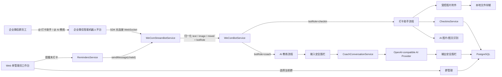
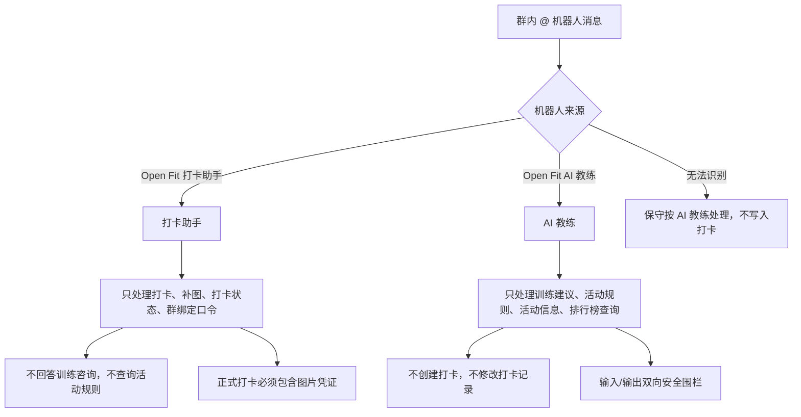
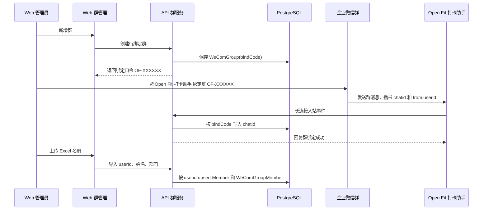
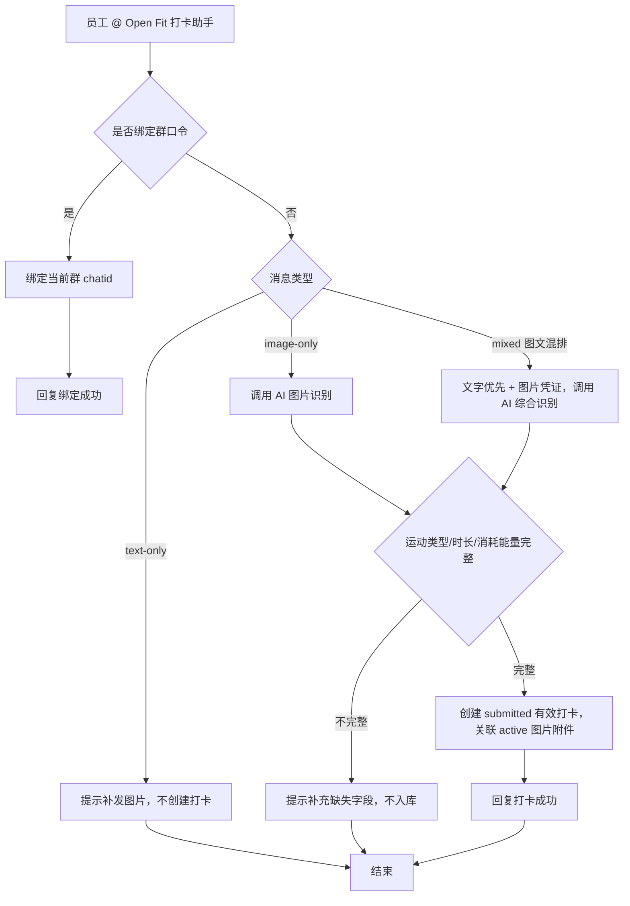
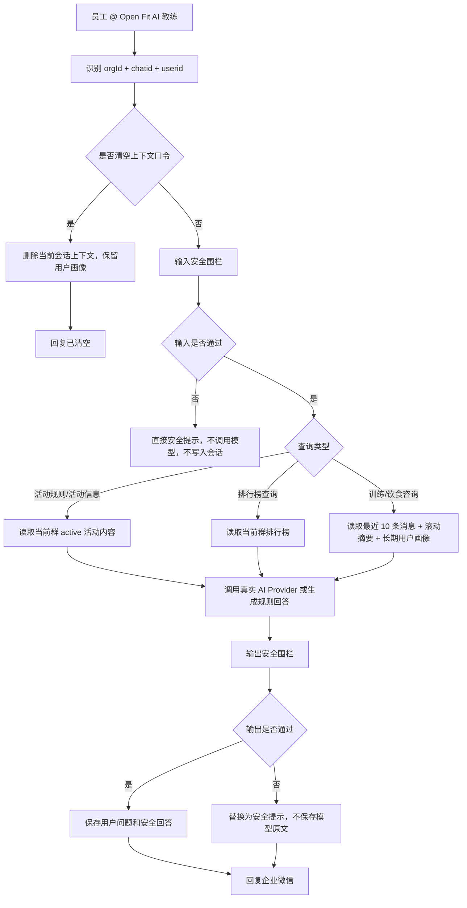
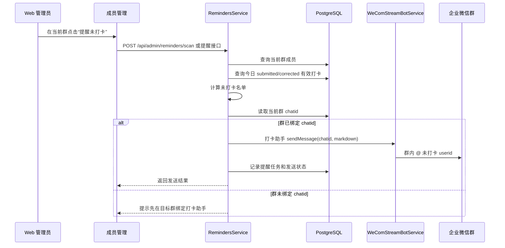
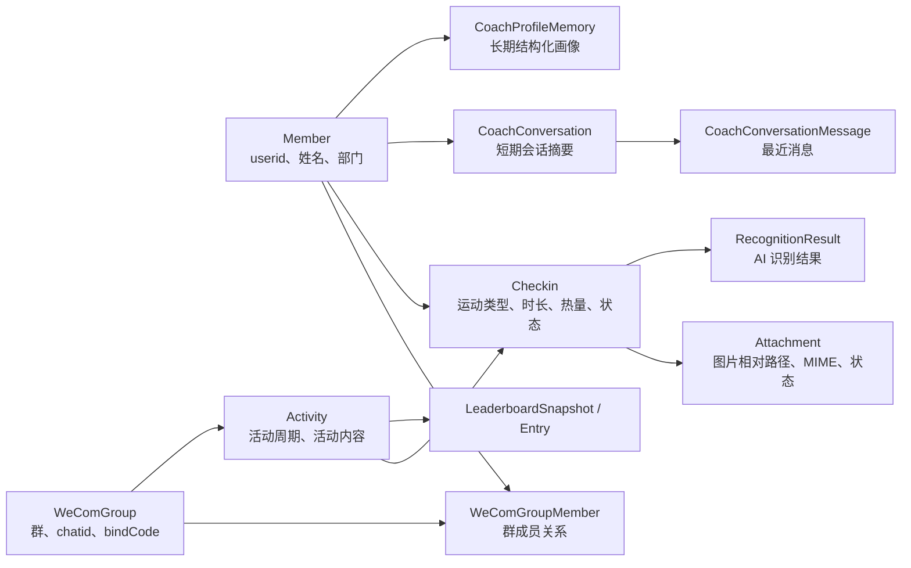

# 机器人架构与流程图

本文档沉淀 Open Fit 当前稳定的企业微信机器人设计。早期讨论中的单机器人、URL 回调、企业微信自建应用、通讯录同步和 webhook 群机器人方案不再作为当前实现路径。

## 总体架构图

## 双机器人职责边界

设计原则：

- 打卡会写入数据库，误判成本高，因此不能让一个机器人同时承担“打卡入库”和“开放咨询”。
- 入口本身就是业务上下文：员工找打卡助手就是提交运动记录，找 AI 教练就是咨询或查询。
- 如果长连接适配层无法识别机器人来源，默认走 AI 教练路径，并禁止写入打卡。

## 群绑定与成员初始化流程

当前产品不依赖企业微信通讯录 Secret。成员中文名和部门来自管理员导入的 Excel 名册；机器人入站消息只稳定依赖 `from.userid`。

## 打卡助手流程

打卡规则：

- 正式企业微信打卡必须有图片凭证。
- text-only 不创建正式打卡，只提示补图。
- image-only 或 mixed 必须调用真实 AI 识别；业务代码不得用固定默认值或本地公式伪造运动类型、时长或热量。
- AI 推断字段完整时直接提交，不再要求员工回复“确认”。
- 打卡助手不读取 AI 教练上下文，避免历史咨询影响打卡入库。

## AI 教练咨询流程

AI 教练记忆策略：

- 群聊会话按 `orgId + chatid + 企业微信 userid` 隔离；单聊按 `orgId + 企业微信 userid` 隔离。
- 每次模型调用只注入最近 10 条消息和滚动摘要。
- 短期会话 3 天未互动后不再注入；超过 30 天未更新的会话记录由服务启动清理。
- 长期结构化用户画像不自动过期，不因“清空上下文”删除。
- 输出安全围栏未通过时，不把模型原文发给用户，也不写入会话历史。

## 后台提醒未打卡流程

提醒规则：

- Web 后台所有运营动作以当前群为边界。
- 未打卡提醒只发送到当前群，不做个人应用消息。
- 消息内容基于当前群未打卡成员的企业微信 `userid` 进行 @。
- 如果当前群没有绑定 `chatid`，提醒功能必须明确提示先完成群绑定。

## 数据与模块关系图

核心边界：

- `WeComGroup.chatId` 是群内主动推送的目标。
- `Member.wecomUserid` 是员工身份主键来源。
- `Activity.ruleJson.content` 是 AI 教练回答活动规则和活动信息的知识来源。
- `Attachment.localPath` 只保存本地相对路径，图片访问必须走后端受控文件路由。
- `CoachConversation` 是短期上下文，不是永久聊天归档；`CoachProfileMemory` 是长期结构化画像。

